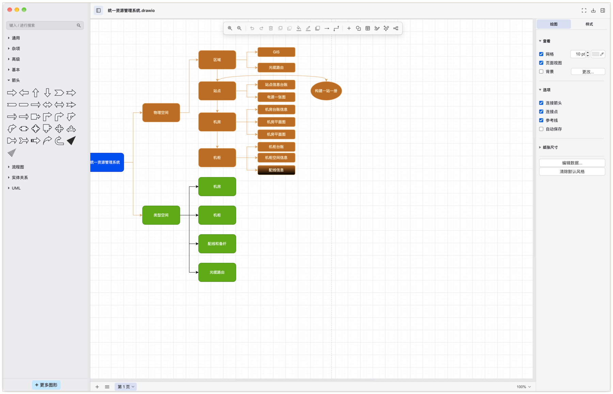

# Van

<p align="center">
  
</p>

**Van** is a focused desktop diagram editor for flowcharts, system architecture, network maps, and technical documentation. It combines the mature [draw.io editor](https://github.com/jgraph/drawio) with an uncluttered native macOS workspace, fast local editing, and Van-specific interaction and visual design.

Van is built with [Electron](https://www.electronjs.org/) and keeps the editor core in the [`drawio`](drawio) submodule so the application shell and the diagram engine can evolve independently.

## Highlights

- Native-feeling macOS layout with a compact toolbar, shape library, inspector, and canvas-first workspace.
- Create and edit flowcharts, architecture diagrams, network diagrams, UML, ER diagrams, and more.
- Works offline after installation. Diagram files stay on your computer unless you explicitly use an external integration.
- Keyboard shortcuts, drag-and-drop shape creation, multi-window editing, import/export, and Quick Look previews.
- Apache-2.0 licensed and free to use.

## Platform Support

Van currently provides an official build for **macOS on Apple Silicon (arm64)** only. The current release is not a universal Intel/Apple Silicon binary, and there are no official Windows or Linux packages yet.

Download the latest Apple Silicon build from the [Releases page](https://github.com/Hong1495/Van/releases/latest):

- `Van-arm64-<version>.dmg` — standard macOS disk image.
- `Van-arm64-<version>.zip` — portable app archive.

The published macOS artifacts are ad-hoc signed and are not Apple-notarized. macOS may ask you to confirm the first launch in **System Settings > Privacy & Security**.

## Privacy and Security

Van is designed to keep diagram data local. The editor does not send diagram content or usage analytics to Van servers. Network access is limited to features you explicitly use and the optional update check. A diagram can still reference external images, fonts, or other media; opening such a file may request those resources from their original URLs.

## Development

Clone the repository with its editor-core submodule:

```bash
git clone --recursive https://github.com/Hong1495/Van.git
cd Van
npm ci
npm start
```

Run the test suite with:

```bash
npm test
```

For local unsigned packaging instructions, see [Building for personal use](doc/BUILDING_FOR_PERSONAL_USE.md). The release process is documented in [doc/RELEASE_PROCESS.md](doc/RELEASE_PROCESS.md).

## License

Van retains the upstream draw.io attribution and notices and is released under the [Apache License 2.0](LICENSE).

Van-specific branding and workspace changes are maintained in this repository.

## Support

Bug reports and feature requests are welcome through [GitHub Issues](https://github.com/Hong1495/Van/issues). Please include your Van version, macOS version, Mac model, and steps to reproduce the problem.
